# Game Review
# Gamification for Learning Evaluation
Name: Muhammad Noor

NIM: 05111850010003

# Introduction
## A. Preface
Evaluation is a process for determining quality, especially related to values and meanings taking into certain criteria. To obtain better evaluation results, an evaluation process must provide principles of continuity, comprehensiveness, fairness and objectivity, co-participation and practical.

The main purpose of the evaluation is to get accurate information about the level of achievement of the instructional goals of students so that the follow-up actions can be pursued such as placement in the right place, giving feedback, diagnosing students' learning difficulties and determining graduation.

## B. Background
1. Paper-based tests, a traditional way of learning evaluation to measure the success of the transfer of knowledge to students. According to Yuliyanto, the Exam is one method to evaluate whether a learning process has reached its goal or not. Evaluation is one of the important components and stages that must be taken by a teacher[1]. 

2. Most students cannot show maximum achievement/express what is understood from the learning process. According to Gesta Wahyu Sasongko, et al., Most students feel nervous when carrying out learning evaluations due to the absence of interesting and fun media to support learning evaluation resulting in evaluation being feared or making students nervous. This condition causes students cannot show their best performance[2].

## C. Problem
How to build a game-based application for evaluation of learning outcomes.

## D. Purpose
1. Assist lecturers in learning evaluation.
2. Facilitate lecturers to correct the evaluation results.
3. Helping students not be nervous, or feel the evaluation is a scary thing.
4. Helping students to show their best achievements / express what is understood from the learning process.

# Basic Components of Game
## A. Game Space
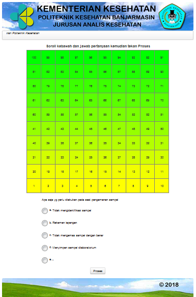

A full-screen web-page that shows the board games, question, and process button.

## B. Boundaries
1. The Game plays when the participant clicks the start button.
2. The board game consisting of 100 slots that must be finished by the participant with answering the questions correctly.
3. Scoring based on the quality of answers.

## C. Rule for Interaction

1. Entering NIM and Password
 
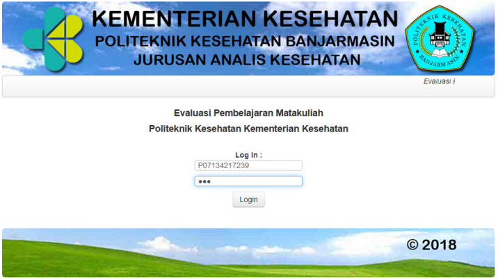

To start the game, participants must fill in the login page by typing in the NIM and password, if the NIM and password entered are correct, participants will be directed to the procedure menu.

2. Read the procedure and press the start button

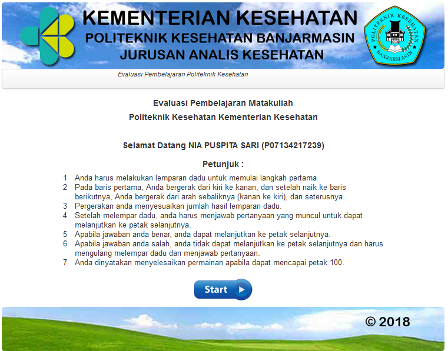

Participants read the procedure to find out how the game progresses and press the start button when you understand the game and to start the game. The game starts from slot 0 which is marked with a game board that only contains plots without the toga icon.

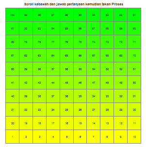

3. Answer multiple choice questions correctly.

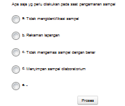

Participants can begin the game by answering the question that appears. Choose the answer and press process button to check the answer.

## D. Artifacts

1. Icon

This toga icon is used to represent the position of participants in the game board.

2. Board Game

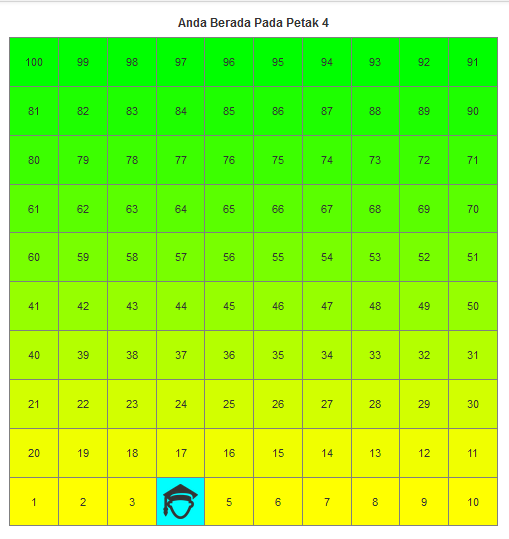

Board game to display the entire slot that must be passed by the participants.

3. Random questions and Process button

Random questions appear as evaluation material that must be answered by the participants.

4. Correct answer

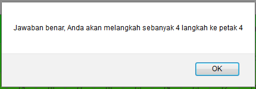

Every answer is correct, an alert will appear informing you that the answer is correct and the number of steps to be taken according to the random results step (1-6).

5. Wrong answer

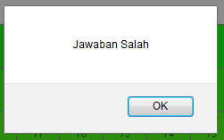

Every wrong answer will appear an alert informing you that the answer given is wrong.

6. Result

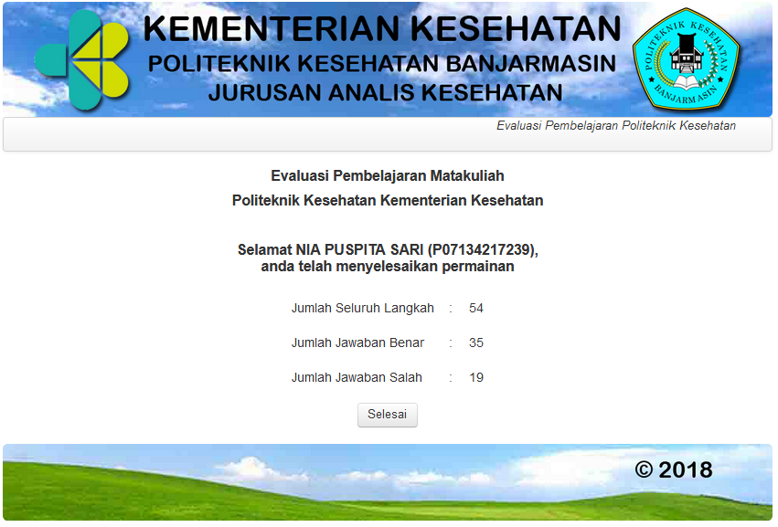

Participants are stated completed the game when they touched 100th slot and participant got information about the number of questions that appeared and the number of right and wrong answers.  

## E. Goal

Learning Evaluation is complete when participants reach the 100th slot.

# Game Design

## A. Game Rules
Participants must answer the questions correctly by choosing 1 of 5 options

## B. Plot

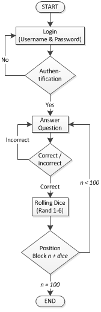

1. Participant fill in the NIM and password correctly
2. Start the game from slot 0 and start answering the questions that arise. Choose the answer and press process button
3. If the answer correct, the participant can move to the next slot with random steps (1-6).
4. If the answer is wrong, the participant stays in the plot and answers the question that appears
6. Icon toga as a representation of the position of participants
7. Participants are declared finished the game when they have reached the 100th slot

## C. Objectives
Participants must answer the question correctly

## D. Challenges

1. Complete the game by answering the questions correctly as many as possible
2. The participant must be as little as possible giving the wrong answer to get the maximum score
3. The fewer questions answered correctly increase the chances of getting high scores

# Game Mechanics

1. Mobility

A participant can move to the next slot by answering the question correctly.

2. Questions

a. Each question consists 5 answer choices (A-E).

b. Each material consists of several questions.

c. Zone system to represent every material that will be tested on certain slots. So that they can ensure that each participant gets questions from all the material that has been taught.

Example :
- Material A consists of 30 questions
- Material A is tested in slots 1-15
- Material B consists of 15 questions
- Material B are tested in plot 16-20
- When participants are in slots 1-15, participants will get random questions from material A (1 of 30 questions)
- When participants are in the 16 - 20 slots, participants will get random questions from material B (1 of 15 questions)

3. Forward is not predictable

- Each correct answer will advance to the next slot according to the number of dice beats (1-6)

- Every answer is wrong, the participant stays in the slot by answering the question that appears. Participants can proceed to the next plot if the answer given is correct

4. Scoring

a. Quality of answers

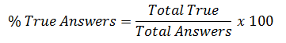

Example :

- Correct answer: 35
- Total number of answers: 54
- Quality of answers: 35 / 54 * 100 = 64 %

b. Final score

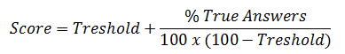

Threshold (optional) is the lower limit given as the initial bonus value for participants.

Example :
- Treshold : 40 points
- Final score : 40 + 64/(100*(100-40)) = 78

# Reference
[1] H. Yuliyanto, “Ujian on Line Dalam E-Learning : Perbandingan Ujian Online ( Computer Based ) Terhadap Ujian Tradisional ( Paper Based ),” 2016.

[2]	G. W. Sasongko and H. Suswanto, “Pengembangan Game Sebagai Media Evaluasi Pembelajaran Pada Mata Pelajaran Perakitan Komputer Kelas X,” pp. 1017–1023, 2017.