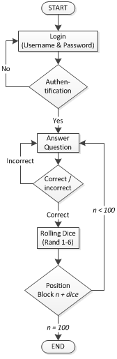

# Game Review
# Gamification for Learning Evaluation
Name: Muhammad Noor

NIM: 05111850010003

# Introduction
## A. Preface
Evaluation is a process for determining quality especially related to values and meanings taking into certain criteria. To obtain better evaluation results, an evaluation process must provide principles of continuity, comprehensiveness, fairness and objectivity, co-participation and practical.

The main purpose of the evaluation is to get accurate information about the level of achievement of the instructional goals of students so that the follow-up actions can be pursued such as placement in the right place, giving feedback, diagnosing students' learning difficulties and determining graduation.

## B. Background
1. So far, to measure the success of the transfer of knowledge to students, evaluation of learning in the traditional way is done, namely paper-based tests. According to Yuliyanto, the Exam is one method to evaluate whether a learning process has reached its goal or not. Evaluation is one of the important components and stages that must be taken by a teacher[1]. 

2. Most students cannot show maximum achievement/express what is understood from the learning process. According to Gesta Wahyu Sasongko, et al., Most students feel nervous when carrying out learning evaluations due to the absence of interesting and fun media to support learning evaluation resulting in evaluation being feared or making students nervous. This condition causes students cannot show their best performance[2].

## C. Problem
1. How to build a game-based application and random questions for media evaluation of learning outcomes.

## D. Purpose
1. Assist lecturers in evaluating learning that has been done.
2. Facilitate lecturers to correct the evaluation results.
3. Helping students not be nervous or feel evaluation is a scary thing.
4. Helping students to show their best achievements / express what is understood from the learning process.

# Basic Components of Game
## A. Game Space
1. Participants play the game by stepping from slot 0 to slot 100.
2. Each slot will bring up a random question. 
3. Zone systems are used to represent certain materials that will appear on certain slots. So that the whole slot will bring up random questions from all the material. 
4. The number of steps generated as a reward for each correct answer is 1 to 6 which is calculated randomly.
5. As the penalty for the wrong answer, the participant will remain in his position and repeat the different questions that will be presented.
6. Assessment is given based on the quality of the answer (the percentage of correct answers to the overall answers given)

## B. Boundaries
System :
1. User Interface: PHP language
2. Database: MySQL 
3. Client - Server
4. Online ( Intranet / Internet)

Interface :
1. Board game consisting of 100 slots with 10 rows and 10 columns.
2. Random questions with 5 answer choices from A to E.
3. Icon Toga as a representation of the position of students in the game board.

Assessment :
1. Every answer is correct, participants can proceed to the next slot.
2. As a punishment for the wrong answer, students will remain in their position and repeat the different questions that will be presented.
3. Assessment is given based on the quality of the answer (the percentage of correct answers to the overall answers given).
4. Participants complete the game when they reach 100th place

## C. Rule for Interaction

1. Entering NIM and Password
 

To start the game, participants must fill in the login page by typing in the NIM and password, if the NIM and password entered are correct, participants will be directed to the procedure menu.

2. Read the procedure and press the start button

Participants read the procedure to find out how the game progresses and press the start button when you understand the game and to start the game. The game starts from slot 0 which is marked with a game board that only contains plots without the toga icon.

3. Answer multiple choice questions correctly

Participants can begin the step by correctly answering the question that appears.

## D. Artifacts

1. Icon

This toga icon is used to represent the position of participants in the game board.

2. Board Game

Board game to display the entire slot that must be passed by the participants.

3. Random questions

random questions appear as evaluation material that must be answered by the participants.

4. Correct answer

Every answer is correct, an alert will appear informing you that the answer is correct and the number of steps to be taken according to the random results step (1-6).

5. Wrong answer

Every wrong answer will appear an alert informing you that the answer given is wrong. So the participants stay on the existing slot and return to having to answer the random questions given.

6. Result

Participants are stated to have completed the game when they touched 100th slots and participants got information about the number of questions that appeared and the number of right and wrong answers.  

## E. Goal

1. Learning Evaluation is complete when participants reach 100th slots.
2. Assessment/scoring is given based on the quality of the answer (comparison of correct answers with the overall answer)

# Game Design

## A. Game Rules

## B. Plot

1. Participants fill in the NIM and password correctly
2. Participants start the game from slot 0 and start answering the questions that arise
3. Participants can step into the next slot by answering the questions correctly
4. If the answer is wrong, the participant stays in the plot and answers the question that appears
5. Icon toga as a representation of the position of participants
6. The number of random steps from 1 to 6
7. Participants are declared to have finished the game when they have reached the 100th slot
8. Assessment is based on the quality of the answers given

## C. Objectives

1. Participants must answer the question correctly
2. To get the maximum score, the participant must be as little as possible giving the wrong answer

## D. Challenges

1. Complete the game by answering as many questions as possible correctly
2. The fewer questions answered correctly increase the chances of getting high scores

# Game Mechanics

1. Random Questions

a. Each material consists of several questions

b. Zone system to represent every material that will be tested on certain slots. So that they can ensure that each participant gets questions from all the material that has been taught.

Example :
- Material A consists of 30 questions
- Material A is tested in slots 1-15
- Material B consists of 15 questions
- Material B is tested in plot 16-20
- When participants are in slots 1-15, participants will get random questions from material A (1 of 30 questions)
- When participants are in the 16 - 20 slots, participants will get random questions from material B (1 of 15 questions)

2. Forward is not predictable

- Each correct answer will advance to the next slot according to the number of dice beats (1-6)

- Every answer is wrong, the participant stays in the slot by answering the question that appears. Participants can proceed to the next plot if the answer given is correct

3. Scoring

a. Quality of answers

Example :

- Correct answer: 35
- Total number of answers: 54
- Quality of answers: 35 / 54 * 100 = 64 %

b. Final score

Threshold (optional) is the lower limit given as the initial bonus value for participants.

Example :
- Treshold : 40 points
- Final score : 40 + 64/(100*(100-40)) = 78

# Reference
[1] H. Yuliyanto, “Ujian on Line Dalam E-Learning : Perbandingan Ujian Online ( Computer Based ) Terhadap Ujian Tradisional ( Paper Based ),” 2016.

[2]	G. W. Sasongko and H. Suswanto, “Pengembangan Game Sebagai Media Evaluasi Pembelajaran Pada Mata Pelajaran Perakitan Komputer Kelas X,” pp. 1017–1023, 2017.